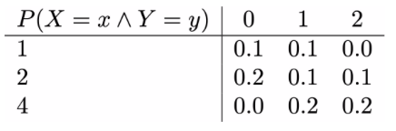

# Generating random variables from joint distributions

Let's consider the distribution in the table below one final time:

Your task now is to complete the function called `gen_sample`.  This function takes three arguments in input `xvals`, `yvals` and `jpmass`.  These variables are:

1. `xvals` - the set of possible x values the random variable X can take
2. `yvals` - the set of possible y values the random variable Y can take
3. `jpmass` - the joint probability mass function.

Your code should use this information to generate a pair of random variables from this joint distribution.  As you can see, I have written code at the end of the exercise to show how the sample means for these two variables change as you increase the number of samples that you are taking from the distribution. 
